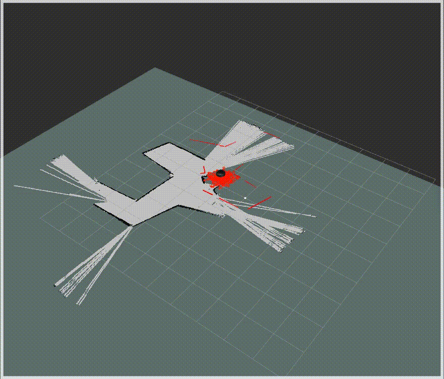

# Robot Localization 2017
### Audrey Lewis and Carl Moser

## Our goal
The particle filter is a method of localization which involves evaluating guesses ("particles") based on their correspondence with real data. In this case, the data being evaluated a laser scan, which is being compared with map data.

## Our solution
To solve the problem of localization, we first initialize a random set of particles. We update the locations of that set of particles with the odom and a random value for each particle. Then, we update the individual weights fo the particles using the laserscan data and a numpy mask to filter out irrelevant data. The weights of the particles are normalized and the particles are resampled.

## Design decision
For the laser scan processing portion of the data, we attempted to expedite the code using matrix math. Instead of manually using trigonometry for rotate the x and y values for each particle individually, we used a rotation matrix in numpy. To do this, we had to account for the fact that although our numpy array of data would always be the same size, our sensor wasn't perfect, and we would get different amounts of valid data. To remove the invalid data from consideration without letting it affect our weighting, we used a masked array. In the end, we had to extract it in the form of a 1D array, and iterate over potential positions.

## Challenges

A challenge that we faced was actually tuning our code. As you can see above, the laser scan, robot model, and visualizations move around and are not aligned with the map. This made tuning the distribution values harder even though we were using dynamic reconfigure.

## Improvements

If we had more time, we would work to get our laser scan, points, and robot model working correctly and aligned with the ground truth. With that working, we would be able to better tune our algorithm with the dynamic reconfigure.

## Lessons learned

We learned a lot about numpy which we will definitely use on future robotics projects. We also learned how to implement a dynamic reconfigure server and client. This drastically improves the ease of testing different values without having to hardcode the values and rerun the node every time.